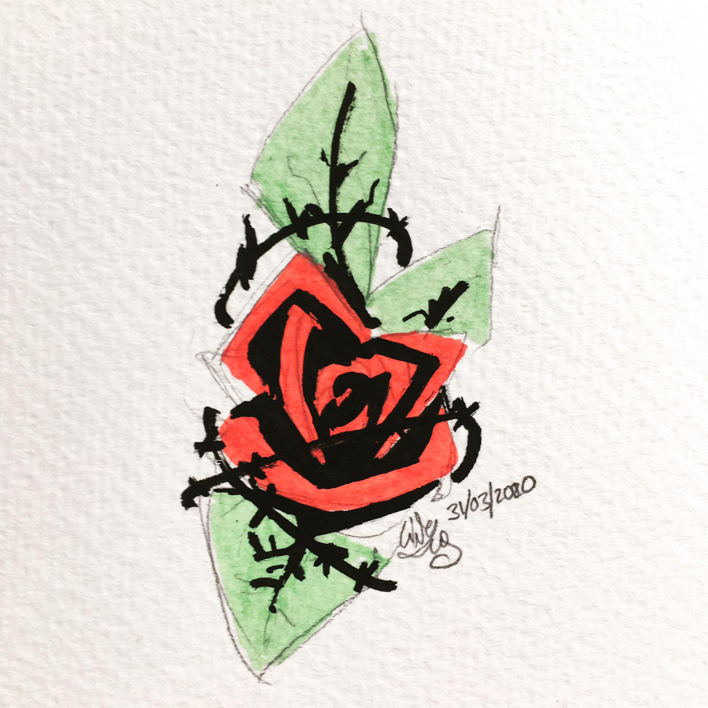
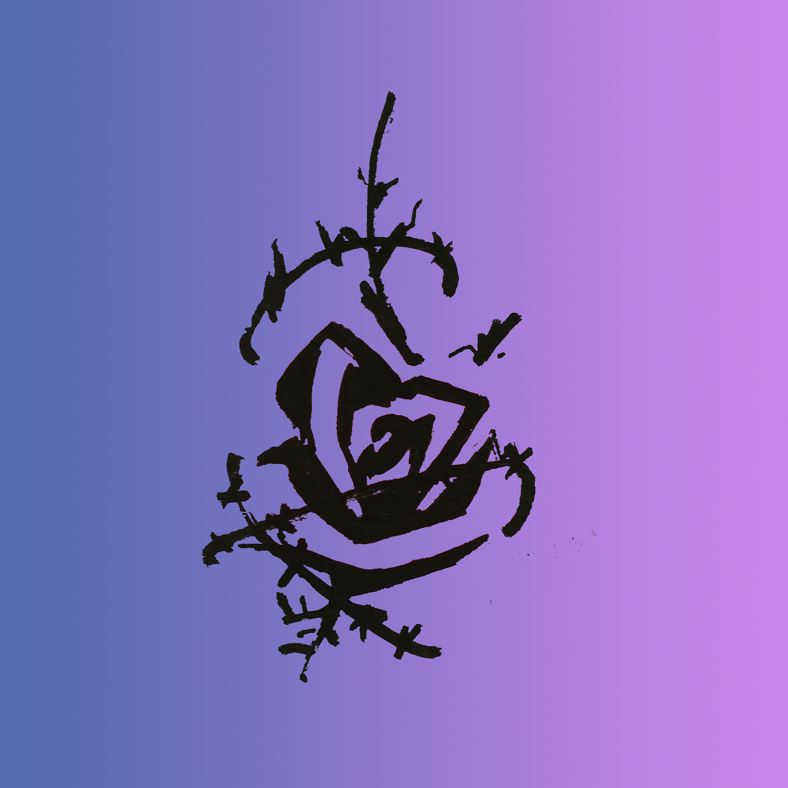
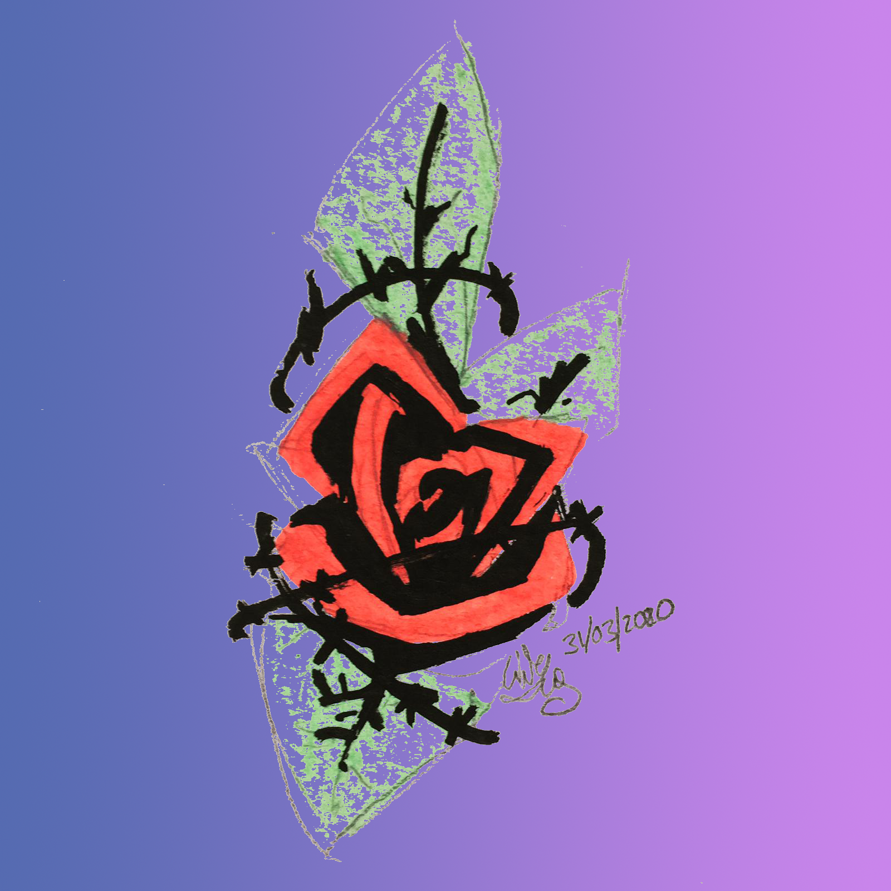
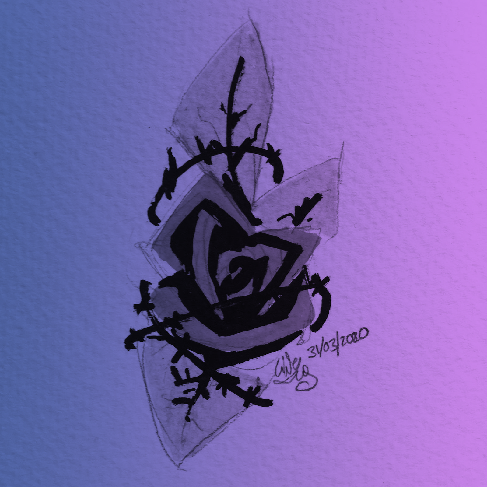
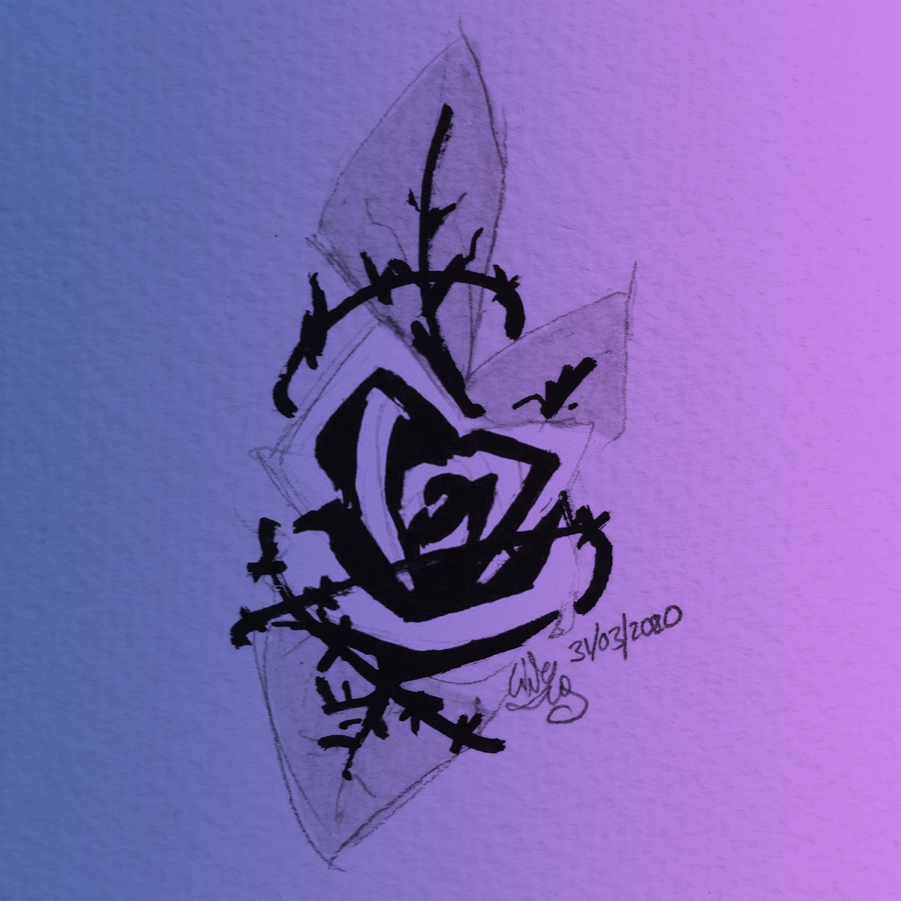
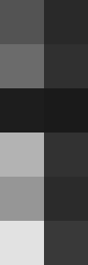
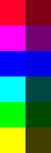

# Black and Transparency converter 

 
This is a program meant to convert color or greyscale images into ones only made of black pixels of varying transparency. 
  

---
- [Explanation](#What-does-that-mean-What-is-this)
- [Technical Details](#How-does-this-work)
    - [Concept](#Concept)
    - [Dependencies](#Dependencies)
- [Use](#What-can-this-be-used-for)
- [Planned changes](#Plans-for-the-future)

---
 

## What does that mean? What *is* this?

Suppose I want to change the background in this scanned drawing I made (or color it in using a layer underneath, could be anything) 
  

Here's the different options for how I could do that in most raster editing software:
 
|Using the blending options in Photoshop with a low threshold| Using the blending options in Photoshop with a high threshold| Using the magic wand to select the background |
|----|----|----|
|| ||

 

If you use this program though, you keep all the detail while still avoiding the grey pixel artefacts: 
 
|Greyscale as seen by the human eye| Greyscale without correcting for the eye|
|---|---|
|||

 

What's the difference between "Greyscale as seen by the human eye" and " Greyscale without correcting for the eye"?  
Well, it's more clear if you look at these pictures:
|Greyscale as seen by the human eye|Original| Greyscale without correcting for the eye|
|:---:|:---:|:---:|
||||
|This version renders how pure blue looks darker than pure yellow, it's a more intuitive way to converting to greyscale|The original contains two rows, one with pure hues, and another of darker colors|This version renders pure colors as white, which is more helpful if you're trying to recolor something|
 

## How does this work?

### Concept

This is a pretty simple program. It converts the image to the RGBA mode first, adding an alpha(transparency) channel. Then it iterates through each pixel, setting the Red, Green and Blue channels to 0 (which gives black), and changing the alpha channel according to the formulas :  
- For greyscale as seen by the human eye: `A = 255 -(R * 299/1000 + G * 587/1000 + B * 114/1000)`
- For greyscale without correcting for the eye : `A  = 255 - max(R, G, B)`
 

### Dependencies

- Pillow v8.4
- Tkinter v8.5
 

## What can this be used for?

This program was mostly created for me, but you could probably use it for: 

- Transforming scanned pencil/ink sketches into something you could color digitally
- Recoloring images
- Transforming images into lineart (in combination with some other filters)
 

## Plans for the future

I don't have anything concrete, but I might add some stuff eventually:
- More options for different greyscale weightings, maybe with user inputed weighting for different channels
- Option for (some other color) and transparency, maybe several colors?