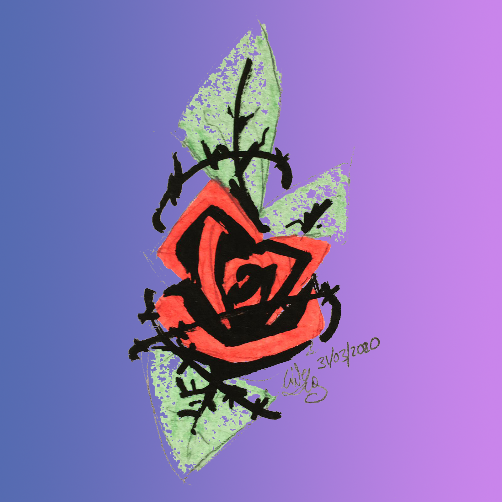

# Black and Transparency converter 
 
This is a program meant to convert color or grayscale images into ones only made of black pixels of varying transparency. 
  

## What does that mean?

 
Suppose I want to change the background in this scanned drawing I made (or color it in using a layer underneath, could be anything) 
  

Here's the different options for how I could do that in most raster editing software:
 
|Using the blending options in Photoshop with a low threshold| Using the blending options in Photoshop with a high threshold| Using the magic wand to select the background |
|----|----|----|
|| ||

 

If you use this program though, you keep all the detail while still avoiding the gray pixel artefacts: 
 
|Grayscale as seen by the human eye| Grayscale without correcting for the eye|
|---|---|
|||

 

What's the difference between "Greyscale as seen by the human eye" and " Greyscale without correcting for the eye"?  
Well, it's more clear if you look at these pictures:
|Grayscale as seen by the human eye|Original| Grayscale without correcting for the eye|
|:---:|:---:|:---:|
||||
|This version renders how pure blue looks darker than pure yellow, it's a more intuitive way to converting to greyscale|The original contains two rows, one with pure hues, and another of darker colors|This version renders pure colors as white, which makes it more helpful if you're trying to recolor something|
